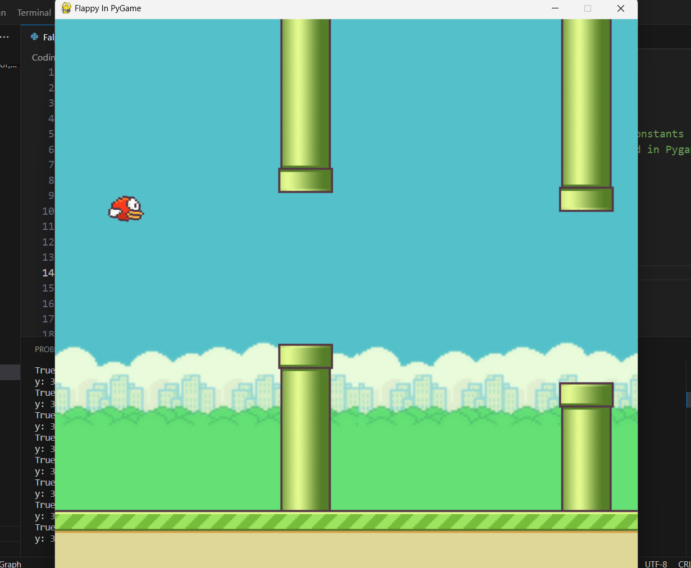

# Flappy Bird Game with Pygame



A simple implementation of the classic Flappy Bird game using Pygame, a popular Python library for game development.

## How to Play

- **Spacebar**: Make the bird fly and avoid pipes.
- **Avoid Pipes**: Navigate the bird through the gaps between the pipes.

## Prerequisites

Make sure you have Python and Pygame installed on your machine. If not, you can install Pygame using:

```bash
pip install pygame
```

## Getting Started

1. Clone the repository:

```bash
git clone https://github.com/your-username/flappy-bird-pygame.git
```

2. Navigate to the project directory:

```bash
cd flappy-bird-pygame
```

3. Run the game:

```bash
python flappy_bird.py
```

## Gameplay

- The bird falls due to gravity. Press the spacebar to make the bird fly.
- Navigate the bird through the gaps between the pipes.
- Pipes will continuously appear, so be attentive!

## Game Structure

1. **Bird Class (`Bird`):**
   - Represents the player-controlled bird.
   - Handles bird animation, gravity, and flying logic.
   - Uses sprite functionality for easy integration with Pygame.

2. **Pipe Class (`Pipe`):**
   - Represents the pipes that the bird must navigate through.
   - Handles the continuous generation of pipes and their movement.
   - Uses sprite functionality for easy integration with Pygame.

3. **Game Loop (`while runningStatus`):**
   - Manages the main game loop, updating and rendering game elements.
   - Handles user input, including spacebar presses for bird control.
   - Controls the continuous appearance and movement of pipes.

## Acknowledgments

This project is a simple yet engaging implementation of the Flappy Bird game using Pygame. Feel free to modify and enhance the code to add more features and improve the gaming experience!

Enjoy playing Flappy Bird with Pygame! 🕹️✨